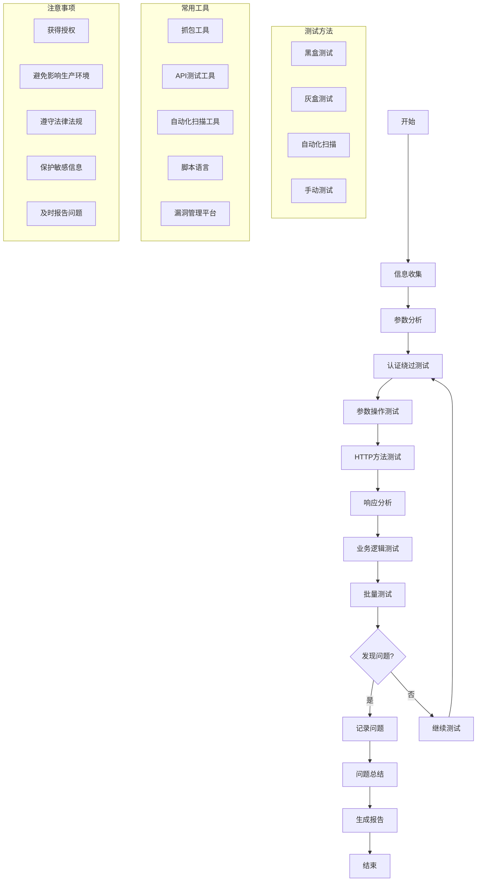

# 敏感信息API未授权访问问题发现
1. 响应中包含敏感信息（如用户名、密码、token等）
   1. 姓名
   2. 手机号
   3. 邮箱
   4. 地址
   5. 身份证
   6. 银行卡
   7. 个人身份信息
2. 路径参数/请求参数/请求体中出现类id参数（如user_id、account_id、order_i/d、product_id等）
   1. user_id
   2. account_id
   3. order_id
   4. product_id
   5. *_id  
   6. 注意id的类型，可能是int，也可能是string
   7. int类型的id，尝试递增、递减、随机id
3. 路径参数/请求参数/请求体中出现类pagesize参数（如page、page_size、limit、size等）
   1. page
   2. page_size
   3. limit
   4. size
   5. 注意pagesize的类型，int类型
   6. 尝试pagesize的边界值，如0、1、100、1000等
   7. 尝试pagesize的随机值
   8. 注意响应中是否包含total、total_page、total_count等参数，如果包含，尝试这些参数的边界值、随机值
4. 删除认证信息（token、cookie、auth等）
   1. 删除token
   2. 删除cookie
   3. 删除auth
   4. 删除uuid
   5. 删除signature
   6. 删除timestamp
   7. 删除nonce
   8. 删除random
   9. 删除sign
   10. 删除appid
   11. 删除appkey
   12. 删除appsecret
   13. 删除认证信息后，再次尝试
5. 尝试删除请求参数不改变结果的参数
   1. 删除请求参数后，再次尝试
   2. 删除请求头后，再次尝试
   3. 删除请求体后，再次尝试
6. 尝试不同的方法（GET、POST、PUT、DELETE等）
   1. GET
   2. POST
   3. PUT
   4. OPTIONS
   5. HEAD
   6. TRACE

## 发现方法

1. 黑盒测试：不了解系统内部结构，仅通过外部接口进行测试
2. 灰盒测试：部分了解系统内部结构，结合内部信息进行测试
3. 自动化扫描：使用专业的API安全扫描工具
4. 手动测试：根据经验和直觉进行针对性测试

## 发现流程

1. 信息收集
   - 收集目标系统的API文档
   - 使用抓包工具分析正常请求和响应
   - 识别认证机制（如token、cookie等）

2. 参数分析
   - 分析URL路径、查询参数、请求头和请求体
   - 识别可能的敏感参数（如user_id、order_id等）

3. 认证绕过测试
   - 删除或修改认证信息
   - 使用无效或过期的认证信息
   - 尝试使用其他用户的有效认证信息

4. 参数操作测试
   - 修改敏感参数值（如更改user_id）
   - 尝试不同类型的输入（如字符串、整数、特殊字符）
   - 测试边界值和异常值

5. HTTP方法测试
   - 尝试不同的HTTP方法（GET、POST、PUT、DELETE等）
   - 测试不常用的HTTP方法（如OPTIONS、TRACE）

6. 响应分析
   - 检查响应中是否包含敏感信息
   - 分析错误消息，寻找可能泄露的系统信息

7. 业务逻辑测试
   - 尝试访问不属于当前用户的资源
   - 测试水平越权和垂直越权场景

8. 批量测试
   - 使用脚本或工具进行批量测试
   - 尝试遍历可能的ID或参数值

## 发现结果记录

对于每个发现的问题，记录以下信息：

1. 问题描述：简要说明发现的未授权访问问题
2. 复现步骤：详细记录如何复现该问题
3. 影响范围：评估该问题可能影响的用户或数据范围
4. 敏感信息类型：说明可能泄露的敏感信息类型
5. 请求详情：
   - HTTP方法
   - 完整URL
   - 请求头
   - 请求体（如果有）
6. 响应详情：
   - 状态码
   - 响应头
   - 响应体（包含敏感信息的部分）
7. 截图或日志：提供问题的视觉证据

## 发现总结

1. 统计发现的未授权访问问题数量
2. 按严重程度分类问题（如高、中、低）
3. 总结常见的未授权访问原因，如：
   - 缺少身份验证
   - 身份验证实现不当
   - 缺少授权检查
   - 越权访问
   - 敏感信息直接暴露在API响应中
4. 提出改进建议，例如：
   - 实施严格的身份验证和授权机制
   - 对所有敏感操作进行权限检查
   - 避免在API响应中直接返回敏感信息
   - 实施API访问控制和限流机制
   - 加强日志记录和监控

## 注意事项

1. 测试前确保已获得合法授权
2. 避免对生产环境造成影响，优先在测试环境进行
3. 遵守相关法律法规和道德规范
4. 及时报告发现的安全问题
5. 保护好测试过程中获取的敏感信息
6. 定期更新测试方法和工具，跟进最新的安全趋势

## 常用工具

1. 抓包工具：Burp Suite, Charles, Fiddler
2. API测试工具：Postman, Insomnia
3. 自动化扫描工具：OWASP ZAP, Acunetix
4. 脚本语言：Python, JavaScript
5. 漏洞管理平台：JIRA, GitLab Issues

通过系统性地执行这个工作手册，可以有效地发现和记录API中的未授权访问问题，为后续的安全加固提供重要依据。

## Mermaid
