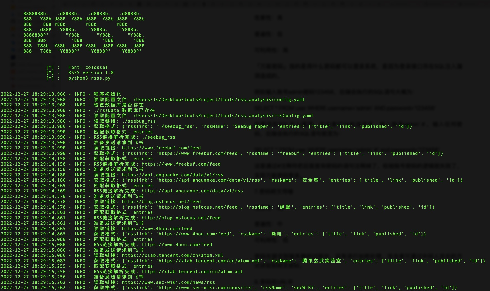
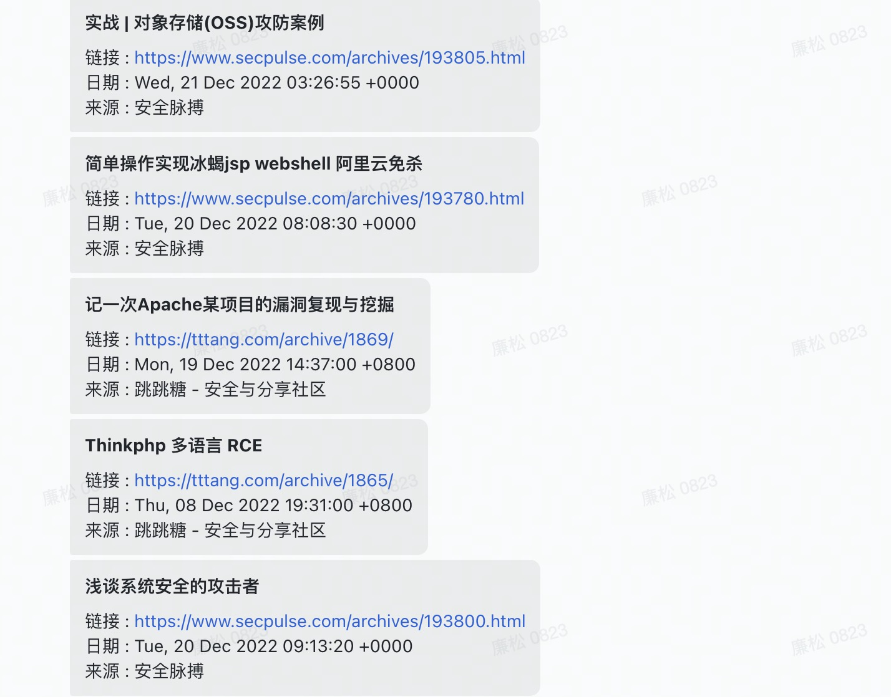

## rss订阅推送飞书

## 快速开始
```
    pip3 install -r ./requirements.txt
    修改 config.yaml 飞书token
    python3 rsss.py
```

## 目录结构
```
    rsss.py             主程序
    config.yaml         配置飞书token、数据库名、数据库表名、建表语句(只需修改飞书token),默认字段不可减少
    rssConfig.yaml      配置获取的rss链接(可追加),默认字段不可减少
```

## 过滤条件
可在config.yaml中`filterSearch`下设置过滤条件
```
    - 漏洞
    - 分析
    - CVE
    - API
    - 研究
    - 复现
    - 技术
```

## 设置定时任务
### 1. 创建rsss.sh
```
    #!/bin/bash
    cd /root/RSSS (项目的绝对路径)
    python3 rsss.py 
```
### 2. 创建定时任务
```
    crontab -e  # 编辑用户任务
    0 */6 * * * sh /root/RSSS/rsss.sh   # 每6小时执行一次 
```

## 支持rss
可在`rssConfig.yaml`文件中继续追加rss链接

参考链接：https://www.freebuf.com/sectool/351368.html
```
    安全咨询：
    FreeBuf互联网安全新媒体平台	
    安全客
    Seebug Paper	
    绿盟
    嘶吼
    腾讯玄武实验室
    SecWiki News(国内外安全资讯)	
    360 核心安全技术博客	
    知道创宇	
    先知技术社区
    信息安全知识库
    美团技术团队
    HackerNews	
    华为安全通告
    安全牛	
    腾讯科恩实验室官方博客	
    Noah Lab - 360	
    天融信阿尔法实验室	
    360 Netlab Blog - 360	
    斗象能力中心 - 网藤风险感知	
    腾讯安全响应中心
    Seebug漏洞社区	
    体验盒子	
    NOSEC 安全讯息平台 - 漏洞预警	
    阿里云公告	
    安全脉搏	
    跳跳糖 - 安全与分享社区
    奇安信A-TEAM技术博客	
    清华大学·网络与信息安全实验室 (NISL)

    公众号：	
    腾讯安全应急响应中心
    SecPulse安全脉搏
    Seebug漏洞平台
    微步在线研究响应中心
    腾讯玄武实验室
    安全客
    长亭安全课堂
    绿盟科技研究通讯
    奇安信威胁情报中心
    腾讯安全威胁情报中心
    安恒信息安全研究院
    三六零CERT
    奇安信CERT
    CNVD漏洞平台
    绿盟科技CERT
    深信服千里目安全实验室
    且听安全
    墨菲安全
```



